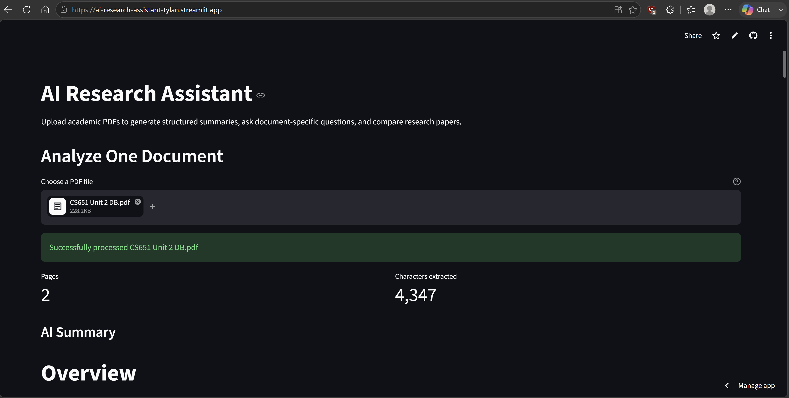
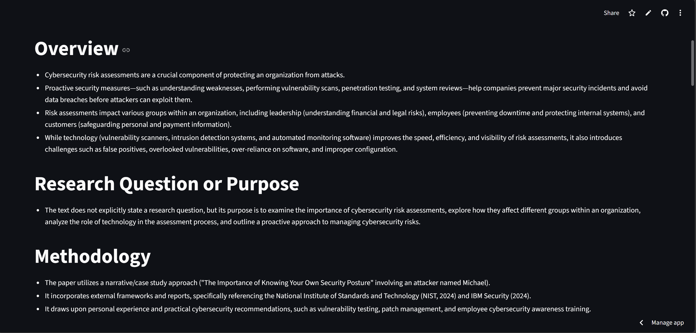
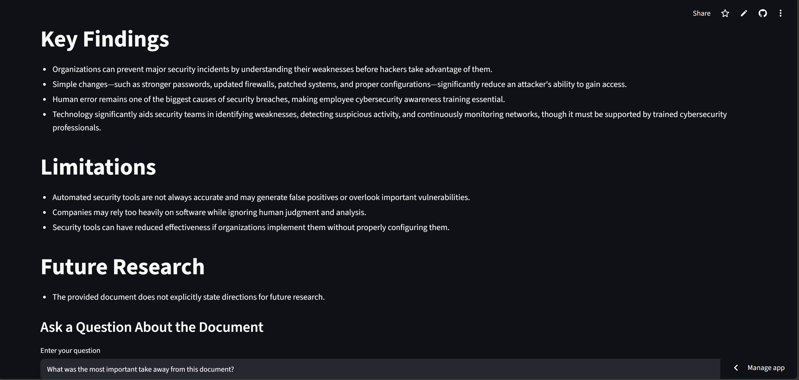
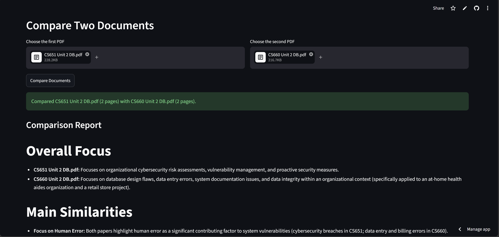
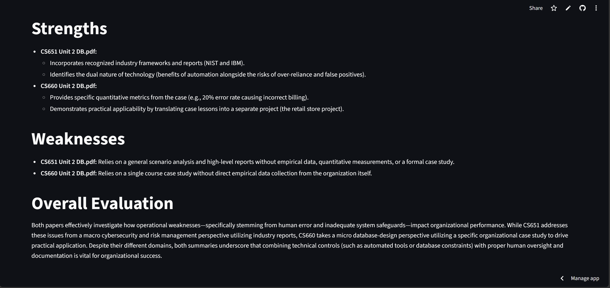

# 🤖 AI Research Assistant

<p align="center">

</p>


An AI-powered research assistant built with Python, Streamlit, and Google Gemini.

## 🚀 Live Demo

https://ai-research-assistant-tylan.streamlit.app/

## ✨ Features

- Upload PDF research papers
- AI-generated summaries
- Ask questions about uploaded documents
- Compare two research papers
- Deployed on Streamlit Community Cloud

## 📸 Application Walkthrough

### Upload & Analyze


### AI Summary


### Ask Questions


### Compare Papers


### Comparison Report


## 🏗️ Architecture

```text
Streamlit UI → PDF Extraction → Gemini Service → Summary / Q&A / Comparison
```

## 🛠️ Tech Stack

- Python 3.14
- Streamlit
- Google Gemini API
- PyPDF
- Git & GitHub

## ⚙️ Installation

```bash
git clone https://github.com/TylanKnight/AI-Research-Assistant.git
cd AI-Research-Assistant
pip install -r requirements.txt
streamlit run app.py
```

Environment variable:

```text
GEMINI_API_KEY=your_api_key
```

## 👨‍💻 About

Created by **Tylan Knight** to demonstrate Python development, AI integration, modular software architecture, and cloud deployment.

⭐ If you found this project useful, consider starring the repository!
