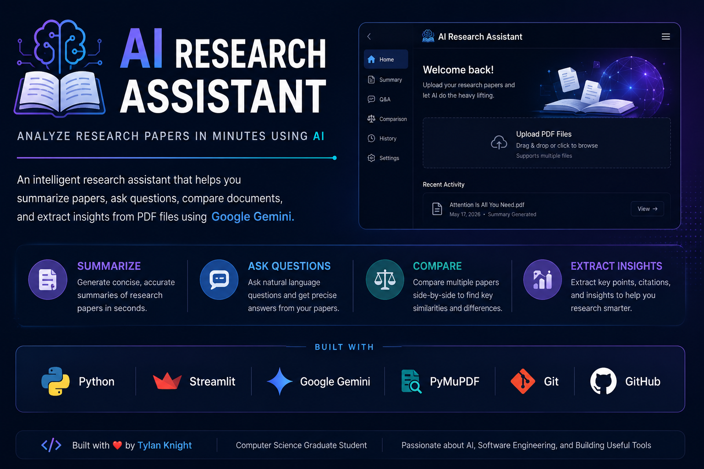
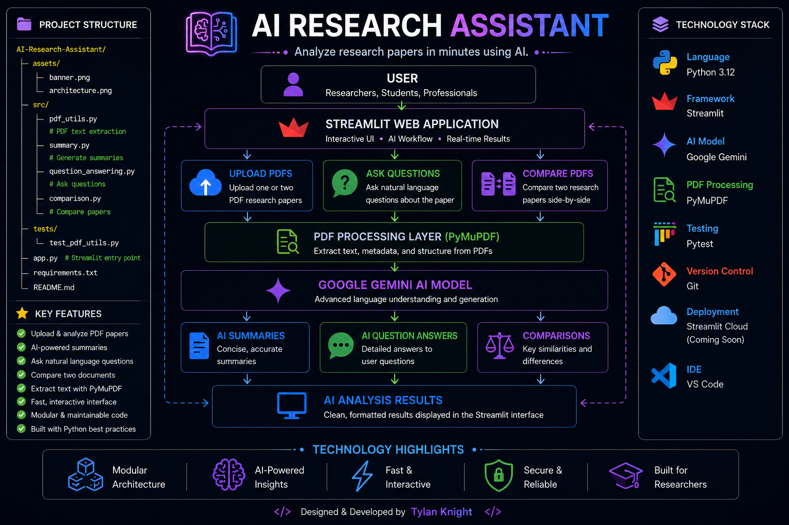

  

<h1 align="center">📚 AI Research Assistant</h1>

Analyze research papers in minutes using AI.

An AI-powered research assistant built with Python, Streamlit, and Google Gemini that summarizes research papers, answers questions, compares documents, and helps users gain insights from academic PDFs.

## 📑 Table of Contents

## 📑 Table of Contents

- [Overview](#-overview)
- [Why I Built This](#-why-i-built-this)
- [Features](#-features)
- [System Architecture](#-system-architecture)
- [Engineering Decisions](#-engineering-decisions)
- [Future Roadmap](#-future-roadmap)
- [About the Developer](#-about-the-developer)
- [What I Learned](#-what-i-learned)

---

# 📖 Overview

AI Research Assistant is an AI-powered web application that helps researchers, students, and professionals analyze academic papers more efficiently. Instead of manually reading lengthy PDF documents, users can upload one or two research papers and leverage Google's Gemini AI model to generate concise summaries, answer questions about the document, and compare multiple papers.

The application combines a clean Streamlit interface with Google's Gemini large language model and PyMuPDF for PDF text extraction, providing an intuitive workflow for exploring complex research documents.

---

## 🌟 Project Highlights

- AI-powered document summarization
- Natural language question answering
- Research paper comparison
- Modular Python architecture
- Interactive Streamlit interface
- Professional software documentation

# 🎯 Why I Built This

Reading research papers can be time-consuming, especially when comparing multiple sources or trying to locate specific information. I built this project to explore how modern large language models can simplify research workflows while improving my skills in Python application development, API integration, modular software architecture, and user interface design.

This project also serves as a portfolio piece demonstrating practical software engineering principles, including clean code organization, reusable modules, API integration, and version control with Git.

---

# ✨ Features

- 📄 Upload and analyze PDF research papers
- 🤖 Generate AI-powered summaries using Google Gemini
- ❓ Ask questions about uploaded documents
- 📚 Compare two research papers side-by-side
- 🔍 Extract text from PDFs using PyMuPDF
- ⚡ Fast and interactive Streamlit interface
- 🧩 Modular project architecture for maintainability
- 🛠️ Built with modern Python development practices

---

# 🏗️ System Architecture

The AI Research Assistant follows a modular architecture that separates the user interface, document processing, AI services, and application logic into individual components. This design improves maintainability, readability, and scalability by keeping each module focused on a single responsibility.

The Streamlit interface serves as the application's presentation layer, while specialized Python modules handle PDF extraction, summarization, question answering, and document comparison. Google Gemini powers the AI capabilities, and PyMuPDF efficiently extracts text from uploaded research papers.

This modular approach makes it easier to extend the application with additional AI features in the future without requiring major changes to the existing codebase.

### Architecture Diagram

  

# 🧠 Engineering Decisions

## Why Streamlit?

I selected Streamlit because it provides a lightweight framework for rapidly developing interactive Python applications. This allowed me to focus on implementing AI functionality and backend logic instead of spending time building a separate frontend.

---

## Why Google Gemini?

Google Gemini provides strong natural language understanding and generation capabilities, making it well-suited for summarizing research papers, answering questions, and comparing documents. Integrating Gemini also gave me hands-on experience working with modern AI APIs.

---

## Why PyMuPDF?

Academic papers often contain complex formatting and large amounts of text. PyMuPDF offers fast and reliable PDF parsing while preserving document content, making it an excellent choice for AI-powered document analysis.

---

## Why a Modular Architecture?

The application separates document processing, summarization, question answering, and comparison into independent Python modules.

This approach improves:

- Code readability
- Easier testing
- Future scalability
- Simpler debugging
- Reusable components

Keeping each module focused on a single responsibility makes the project easier to maintain as new features are added.

# 🚀 Future Roadmap

### Version 1.1
- Export AI summaries as PDF or Markdown
- Improve summary formatting with section headings
- Display extracted document metadata

### Version 1.2
- Support DOCX and TXT document uploads
- Add semantic keyword search across uploaded papers
- Improve comparison results with side-by-side highlighting

### Version 2.0
- Multi-document research workspace
- Citation extraction and bibliography generation
- AI-powered literature review assistant
- Cloud deployment with persistent storage

# 👨‍💻 About the Developer

Hi! I'm **Tylan Knight**, a Computer Science graduate student with a passion for software engineering, artificial intelligence, and cloud technologies.

I enjoy designing applications that solve practical problems while continuously improving my skills in Python development, software architecture, and modern AI technologies.

The AI Research Assistant reflects my interest in combining machine learning with user-friendly software to simplify research workflows. Building this project strengthened my experience with API integration, modular application design, version control using Git, and documenting software using professional engineering practices.

I'm currently expanding my portfolio by building additional software engineering and AI-focused projects as I prepare for internships and full-time software engineering opportunities.

# 📚 What I Learned

Building this application helped me gain practical experience with:

- Designing modular Python applications
- Working with third-party AI APIs
- Processing and analyzing PDF documents
- Creating interactive web applications with Streamlit
- Applying Git and GitHub for version control
- Writing professional software documentation
- Structuring projects for maintainability and scalability

This project reinforced the importance of clean architecture, reusable code, and user-focused software design.

---

Made with ❤️ using Python, Streamlit, and Google Gemini

